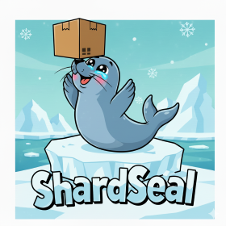

# ShardSeal

## Open S3-compatible, self-healing object store written in Go. Work in progress, not production-ready yet:

- Implemented
  - S3 basics: ListBuckets (/), CreateBucket (PUT /{bucket}), DeleteBucket (DELETE /{bucket})
  - Objects: Put (PUT /{bucket}/{key}), Get (GET), Head (HEAD), Delete (DELETE)
  - Range GET support (single range, requires seekable storage)
  - ListObjectsV2 (bucket object listing with prefix, pagination)
  - Multipart uploads (initiate/upload-part/complete/abort)
  - Config (YAML + env), structured logging, CI
  - Prometheus metrics (/metrics) and HTTP instrumentation
  - Tracing: OpenTelemetry scaffold (optional; OTLP gRPC/HTTP); spans include s3.error_code; optional s3.key_hash via config
  - Authentication: AWS Signature V4 (optional; header and presigned URL)
  - Local filesystem storage backend (dev/MVP), in-memory metadata store
  - Admin API (optional, separate port) with optional OIDC + RBAC: /admin/health, /admin/version; multipart GC endpoint (/admin/gc/multipart)
  - Unit tests for buckets/objects/multipart
  - **Production-ready fixes:** Streaming multipart completion, safe range handling, improved error logging
- Not yet implemented
  - ShardSeal v1 self-healing format, erasure coding, background scrubber
  - Distributed metadata/placement

## Quick start
### Prerequisites
- Go 1.22+ installed

### Build and run
```bash
make build
# Run with sample config (will ensure ./data exists)
SHARDSEAL_CONFIG=configs/local.yaml make run
# Or
# go run ./cmd/shardseal
```

Default address: :8080 (override with env SHARDSEAL_ADDR). Data dirs: ./data (override with env SHARDSEAL_DATA_DIRS as comma-separated list).

### Using with curl (auth disabled by default; SigV4 optional)
Bucket naming: 3-63 chars; lowercase letters, digits, dots, hyphens; must start/end with letter or digit.

```bash
# List all buckets
curl -v http://localhost:8080/

# Create a bucket
curl -v -X PUT http://localhost:8080/my-bucket

# Put an object (from stdin)
printf 'Hello, ShardSeal!\n' | curl -v -X PUT http://localhost:8080/my-bucket/hello.txt --data-binary @-

# Get an object
curl -v http://localhost:8080/my-bucket/hello.txt

# Range GET (first 10 bytes)
curl -v -H 'Range: bytes=0-9' http://localhost:8080/my-bucket/hello.txt

# Head object
curl -I http://localhost:8080/my-bucket/hello.txt

# List objects in bucket
curl -s "http://localhost:8080/my-bucket?list-type=2"

# List with prefix filter
curl -s "http://localhost:8080/my-bucket?list-type=2&prefix=folder/"

# Delete object
curl -X DELETE http://localhost:8080/my-bucket/hello.txt

# Delete bucket (must be empty - excludes internal .multipart files)
curl -X DELETE http://localhost:8080/my-bucket
```

## Testing
```bash
go test ./...
# Verbose tests for just the S3 API package
go test ./pkg/api/s3 -v
```

## Metrics
- Exposes Prometheus metrics at /metrics on the same HTTP server.
- Default counters and histograms:
  - shardseal_http_requests_total{method,code}
  - shardseal_http_request_duration_seconds_bucket/sum/count{method,code}
  - shardseal_http_inflight_requests
- Example:
```bash
curl -s http://localhost:8080/metrics | head -n 20
```

## Health endpoints
- /livez: liveness probe (always OK when process is running)
- /readyz: readiness probe gated on initialization completion
- /metrics: Prometheus metrics endpoint

## Monitoring (Prometheus + Grafana)
- Prometheus sample config: configs/monitoring/prometheus/prometheus.yml
- Example alert rules: configs/monitoring/prometheus/rules.yml
- Grafana dashboard (import JSON): configs/monitoring/grafana/shardseal_overview.json

Quick start:
```bash
# 1) Run shardseal (default :8080 exposes /metrics)
SHARDSEAL_CONFIG=configs/local.yaml make run

# 2) Start Prometheus (adjust path as needed)
prometheus --config.file=configs/monitoring/prometheus/prometheus.yml

# 3) Import Grafana dashboard JSON:
#    configs/monitoring/grafana/shardseal_overview.json
#    and set the Prometheus datasource accordingly.
```

Tracing and S3 error headers
- Server spans include: http.method, http.target, http.route, http.status_code, user_agent.original, net.peer.ip, http.server_duration_ms.
- S3 attributes (low cardinality): s3.op, s3.bucket_present, s3.admin, s3.error. New: s3.error_code on failures; optional s3.key_hash when enabled.
- Enable s3.key_hash via config (tracing.keyHashEnabled: true) or env (SHARDSEAL_TRACING_KEY_HASH=true). The key hash is sha256(key) truncated to 8 bytes (16 hex chars).
- Error responses include the header X-S3-Error-Code mirroring the S3 error code for observability. This header is only set on error responses.

Admin endpoints (optional; if admin server enabled). If OIDC is enabled, these endpoints require a valid Bearer token. RBAC defaults are enforced: admin.read for GET endpoints; admin.gc for POST /admin/gc/multipart.
- /admin/health: JSON status with ready/version/addresses
- /admin/version: JSON version info
- POST /admin/gc/multipart: run a single multipart GC pass (requires RBAC admin.gc; OIDC-protected if enabled)

## Configuration
Example at configs/local.yaml:
```yaml
address: ":8080"
# Optional admin/control plane on a separate port (read-only endpoints)
# adminAddress: ":9090"

dataDirs:
  - "./data"

# Authentication (optional)
# authMode: "none"        # "none" or "sigv4"
# accessKeys:
#   - accessKey: "AKIAEXAMPLE"
#     secretKey: "secret"
#     user: "local"

# Tracing (optional - OpenTelemetry OTLP)
# tracing:
#   enabled: false
#   endpoint: "localhost:4317"  # grpc default; or "localhost:4318" for http
#   protocol: "grpc"            # "grpc" or "http"
#   sampleRatio: 0.0            # 0.0-1.0
#   serviceName: "s3free"
#   keyHashEnabled: false      # emit s3.key_hash; or set SHARDSEAL_TRACING_KEY_HASH=true
```

Additional optional request size limits:
```yaml
# Request size limits (optional)
limits:
  singlePutMaxBytes: 5368709120    # 5 GiB cap for single PUT
  minMultipartPartSize: 5242880    # 5 MiB minimum for non-final multipart parts
```
<pre>
Environment overrides:
- SHARDSEAL_CONFIG                 // path to YAML config
- SHARDSEAL_ADDR                   // data-plane listen address (e.g., 0.0.0.0:8080)
- SHARDSEAL_ADMIN_ADDR             // admin-plane listen address (e.g., 0.0.0.0:9090) to enable admin endpoints
- SHARDSEAL_DATA_DIRS              // comma-separated data directories
- SHARDSEAL_AUTH_MODE              // "none" (default) or "sigv4"
- SHARDSEAL_ACCESS_KEYS            // comma-separated ACCESS_KEY:SECRET_KEY[:USER]
- SHARDSEAL_TRACING_ENABLED        // "true"/"false"
- SHARDSEAL_TRACING_ENDPOINT       // e.g., localhost:4317 (grpc) or localhost:4318 (http)
- SHARDSEAL_TRACING_PROTOCOL       // "grpc" or "http"
- SHARDSEAL_TRACING_SAMPLE         // 0.0 - 1.0
- SHARDSEAL_TRACING_SERVICE        // service.name override
- SHARDSEAL_TRACING_KEY_HASH       // "true"/"false"; when true, emit s3.key_hash (sha256 first 8 bytes hex of object key)
- SHARDSEAL_GC_ENABLED             // "true"/"false" to enable multipart GC
- SHARDSEAL_GC_INTERVAL            // e.g., "15m"
- SHARDSEAL_GC_OLDER_THAN          // e.g., "24h"
- SHARDSEAL_OIDC_ENABLED           // "true"/"false" to protect Admin API with OIDC
- SHARDSEAL_OIDC_ISSUER            // issuer URL for discovery (preferred)
- SHARDSEAL_OIDC_CLIENT_ID         // expected client_id (audience)
- SHARDSEAL_OIDC_AUDIENCE          // optional, overrides client_id
- SHARDSEAL_OIDC_JWKS_URL          // direct JWKS URL alternative to issuer
- SHARDSEAL_OIDC_ALLOW_UNAUTH_HEALTH   // "true"/"false" to allow unauthenticated /admin/health
- SHARDSEAL_OIDC_ALLOW_UNAUTH_VERSION  // "true"/"false" to allow unauthenticated /admin/version
- SHARDSEAL_LIMIT_SINGLE_PUT_MAX_BYTES     // e.g., 5368709120 (5 GiB)
- SHARDSEAL_LIMIT_MIN_MULTIPART_PART_SIZE  // e.g., 5242880 (5 MiB)
</pre>

## Authentication (optional SigV4)
- Disabled by default. Enable verification and provide credentials either via config or environment:
```bash
export SHARDSEAL_AUTH_MODE=sigv4
export SHARDSEAL_ACCESS_KEYS='AKIAEXAMPLE:secret:local'
# Run server after setting env
SHARDSEAL_CONFIG=configs/local.yaml make run
```
When enabled, the server requires valid AWS Signature V4 on S3 requests (both Authorization header and presigned URLs are supported). Health endpoints (/livez, /readyz, /metrics) remain unauthenticated.

## Notes & limitations (current MVP)
- Authentication: optional. AWS SigV4 supported (header and presigned; disabled by default via config/env).
- ETag is MD5 of full object for single-part PUTs
- Objects stored under ./data/objects/{bucket}/{key}
- Multipart temporary parts stored in separate staging bucket: .multipart/<bucket>/<object-key>/<uploadId>/part.N (excluded from user listings and bucket empty checks; cleaned up on complete/abort)
- Range requests require seekable storage (LocalFS supports this)
- Single PUT size cap: 5 GiB (configurable via limits.singlePutMaxBytes or env SHARDSEAL_LIMIT_SINGLE_PUT_MAX_BYTES). Larger uploads must use Multipart Upload (responds with S3 error code EntityTooLarge).
- Error detail: EntityTooLarge responses include MaxAllowedSize and a hint to use Multipart Upload.
- Multipart part size: 5 MiB minimum for all parts except the final part (configurable via limits.minMultipartPartSize or env SHARDSEAL_LIMIT_MIN_MULTIPART_PART_SIZE). Intended for S3 compatibility; very small multi-part aggregates used in tests may bypass this check.
- LocalFS writes are atomic via temp+rename on Put, reducing risk of partial files on error.

## Recent Improvements (2025-10-29)
- Implemented AWS SigV4 authentication verification (headers and presigned) with unit tests
- Exposed Prometheus metrics at /metrics and added HTTP instrumentation middleware
- Added liveness (/livez) and readiness (/readyz) endpoints; readiness gated after initialization
- Fixed critical memory issues: streaming multipart completion; safe handling for non-seekable Range GET
- Hid internal multipart files from listings and bucket-empty checks; normalized temp part layout

## Recent Improvements (2025-10-30)
- Tracing enrichment: error responses now set X-S3-Error-Code; tracing middleware records s3.error_code.
- Optional s3.key_hash attribute on spans (sha256(key) truncated to 8 bytes hex), configurable via tracing.keyHashEnabled or env SHARDSEAL_TRACING_KEY_HASH=true.
- README, sample config, and tests updated accordingly.

## Roadmap (short)
1) ShardSeal v1 storage format + erasure coding
2) Background scrubber and self-healing
3) Admin API hardening (OIDC/RBAC), monitoring assets (dashboards/alerts)

## License
Apache-2.0

## Contributing
Early-stage project — issues and PRs welcome. Please keep code documented and tested.
